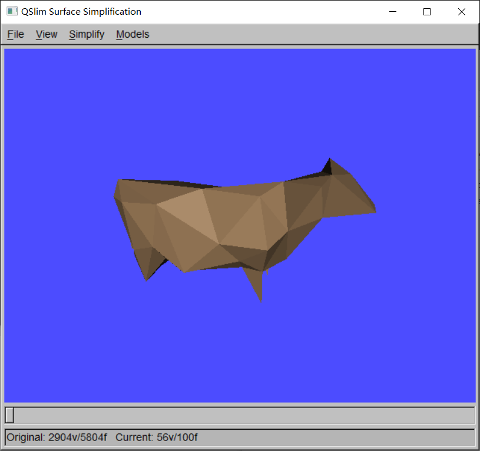

### QSlim

QSlim全称为Quadric-based Simplification Algorithm，是由*Michael Garland*于1999年所提出的一种基于边折叠简化算法的格网简化开源库。该算法库包含libgfx、MixKit、QSlim三个核心算法库以及QVis、SMFView两个图形可视化基础库，其基本介绍如下：

**libgfx**:            图形处理库；
**MixKit**:          QSlim的主要库；
**QSlim**:           QSlim的命令行工具；
**QVis**：           有图形界面的QSlim，如下图所示；
**SMFView**:      \*.smf模型查看工具。

libgfx库和Qvis库都依赖于开源图形用户界面库FLTK，也即Fast Light Tool Kit，发音为/fulltick/。该库的编译并不复杂，唯一需要注意的是FLTK库的版本号为1.3.0，需要的各库的版本如下：

> **依赖库**         **版本号**          **编译方式**
> FLTK            1.3.0             tools/fltk-1.3.0/ide/VisualC2010/fltk.sln
> libjpeg         8d                 tools/jpeg-8d；jconfig.vc改成jconfig.h, 执行`nmake -f makefile.vc`
> zlib               1.2.5             tools/zlib-1.2.5/contrib/vstudio/vc10/zlibvc.sln
> libpng          1.4.11           tools/libpng-1.4.11/projects/vstudio/vstudio.sln
> libtiff            4.0.3             tools/tiff-4.0.3；编辑nmake.opt, 执行`nmake -f Makefile.vc`

### 参考文献

1. CSDN博客. [Windows下的QSLIM编译和使用](https://blog.csdn.net/aero5566/article/details/18715409)[EB/OL].
2. CSDN博客.[zlib1.2.5 编译](https://blog.csdn.net/zhouxuguang236/article/details/8273504)[EB/OL].
3. CSDN博客.[模型简化](https://blog.csdn.net/qq_22822335/article/details/50924703)[EB/OL].
4. Michael Garland.[QSlim Simplification Software](http://www.cs.cmu.edu/~./garland/quadrics/qslim.html)[EB/OL].
5. Michael Garland.[QSlim 2.1](http://mgarland.org/software/qslim.html)[EB/OL].
6. Steven Skiena.[The Stony Brook Algorithm Repository](https://algorist.com/algorist.html)[EB/OL].
7. Michael Garland. [Quadric-Based Polygonal Surface Simplification](http://mgarland.org/research/thesis.html). Ph.D. dissertation, Computer Science Department, Carnegie Mellon University, CMU-CS-99-105, May 1999. 